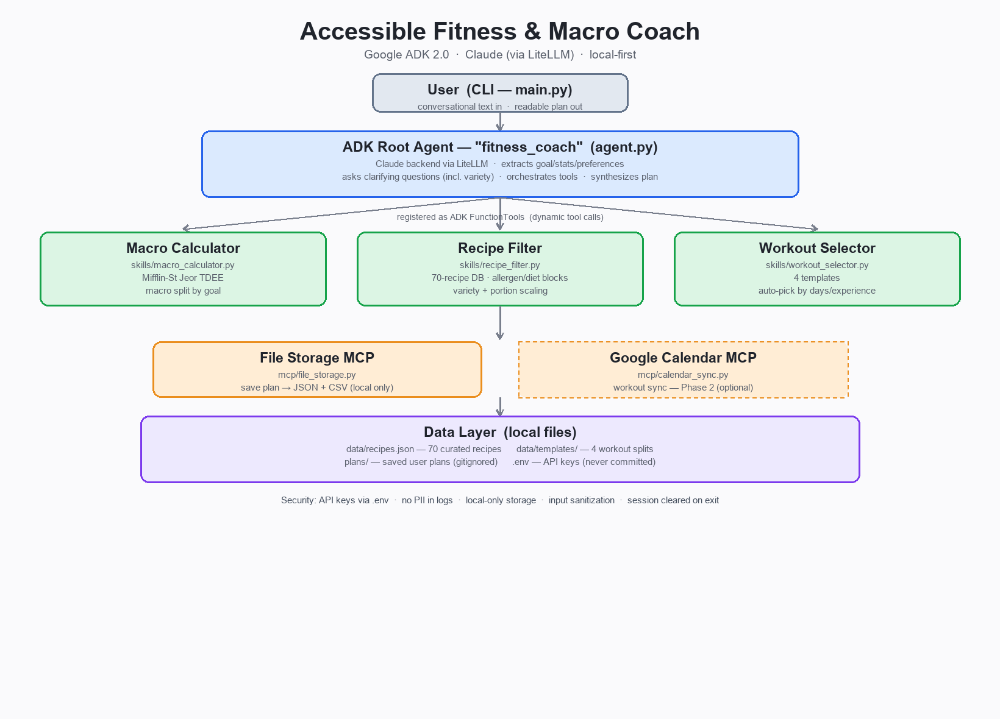

# Accessible Fitness & Macro Coach

A personal AI agent — built on **Google ADK 2.0** with **Claude** as the LLM
backend — that turns a short conversation into a personalized **7-day meal plan**,
a **shopping list**, and a **weekly workout**. You describe your goal, body stats,
food preferences, and training availability in plain language; the agent reasons
over all of it at once and produces a plan you can act on the same day.

> **Kaggle AI Agents Capstone — Concierge Agents track.** Author: Sanchit Rai.



## Why an agent (not a form)?

A traditional fitness app asks you to fill in a form and returns a template. This
agent **reasons**. When you say *"I want to bulk, I eat mostly Italian and Asian
food, and I can't stand mushrooms,"* it extracts your goal, stats, and preferences
simultaneously, calls a **macro calculator** to derive your calorie and protein
targets, passes those targets into a **recipe filter** that searches a curated
database against every constraint at once, picks a **workout template** for your
schedule, and synthesizes the whole plan in a single reasoning loop. If you say
*"actually, skip beef this week,"* it re-runs the filter instead of starting over.
That is agent behavior, not a lookup table.

## Setup

```bash
git clone https://github.com/SanchitACP/fitness-coach-agent.git
cd fitness-coach-agent
pip install -r requirements.txt
cp .env.example .env          # then add your ANTHROPIC_API_KEY
python main.py
```

You need an Anthropic API key (`console.anthropic.com`). Claude runs **inside**
ADK via LiteLLM — see [docs/adk_setup_notes.md](docs/adk_setup_notes.md) for why
the model is wired as `LiteLlm("anthropic/claude-sonnet-4-6")` rather than a bare
string.

## Example

```
You: I want to bulk. 180 lbs, 5'10", 25, male, moderate activity.
     I like Italian and Asian food. No peanuts. I train 5 days a week,
     intermediate. I like variety in my meals.

Coach: A couple of quick questions before I build your plan:
       1. Max prep time per meal?
       2. Any foods you'd rather avoid (not allergies)?

You: 35 minutes max, and I dislike mushrooms. Build it.

Coach: Here's your plan — 3,102 kcal | 233g protein | 349g carbs | 86g fat
       (Mifflin-St Jeor; +/-100 cal individual variance)

       Day 1
         Breakfast  Protein Pancakes      x1.96   747 cal
         Lunch      Salmon Poke Bowl      x1.96   892 cal
         Dinner     Chicken Pesto Pasta   x1.96  1078 cal
         Snack      Salted Edamame        x1.96   392 cal
         Total      3,109 cal | 243g protein
       ... (7 days) + shopping list grouped by category + 5-day Upper/Lower workout

[Saved your plan to: plans/plan_20260627_083746.json, plans/plan_20260627_083746.csv]
```

Plans are saved locally as JSON (full record) and CSV (spreadsheet-friendly meal
table). See [demo/sample_output.json](demo/sample_output.json) for a complete
example, and [docs/recipe_list.md](docs/recipe_list.md) for the recipe database.

## Course concepts demonstrated

| Concept | Where | File(s) |
|---------|-------|---------|
| **Agent (ADK)** | Root agent runs Claude via LiteLLM and orchestrates the tools | [agent.py](agent.py) |
| **Agent Skills** | Three skills registered as ADK `FunctionTool`s with typed schemas | [skills/macro_calculator.py](skills/macro_calculator.py), [skills/recipe_filter.py](skills/recipe_filter.py), [skills/workout_selector.py](skills/workout_selector.py) |
| **MCP Server** | Local file MCP saves plans; Calendar MCP stub for Phase 2 | [mcp/file_storage.py](mcp/file_storage.py), [mcp/calendar_sync.py](mcp/calendar_sync.py) |
| **Security** | Env-only keys, no PII in logs, local storage, input sanitization, session clearing | [main.py](main.py), [utils/validators.py](utils/validators.py), [SECURITY.md](SECURITY.md) |
| **Deployability** | One command (`python main.py`); cloud = clone + set env + run | this README + video |
| **Antigravity** | Polished UI wrapper shown in the demo video | video only |

## Design decisions

- **Why ADK + Claude:** ADK gives the agent loop, tool registration, and skill
  composition the rubric expects; Claude is the reasoning backend, wired through
  LiteLLM so it runs *inside* ADK rather than as raw SDK calls.
- **Why a curated 70-recipe database (not a live API):** reliability and a demo
  that can't fail on a rate limit or network blip. The agent's intelligence is in
  the *filtering and reasoning*, not the size of the database. Swapping in a live
  nutrition API is the first item in [FUTURE.md](FUTURE.md).
- **Why portion scaling:** individual recipes are ~400–500 cal, so the filter
  scales servings per day to hit calorie targets — that's how a 3,100-cal bulk is
  reachable from the same recipes a 1,600-cal cut uses.
- **Why variety is a question, not a rule:** some people want a different meal
  every day; others meal-prep the same breakfast all week. Neither is "right," so
  the agent asks and passes `variety="varied"` or `"simple"`.
- **Why local-only storage:** this is a Concierge (personal) agent — your body
  stats, goals, and plans never leave your machine.

## Testing

```bash
pytest          # 71 unit tests: skills, MCP, security, CLI wiring
```

The live conversation is verified manually (it needs the API key); everything
around it is unit-tested.

## Project layout

```
agent.py            # ADK root agent + registered skills
main.py             # CLI loop + security layer (keys, logging, session clearing)
skills/             # macro_calculator, recipe_filter, workout_selector
mcp/                # file_storage (core), calendar_sync (Phase 2 stub)
data/               # recipes.json (70), templates/ (4 workouts)
utils/              # validators (sanitization), formatters (CLI output)
tests/              # unit tests
docs/               # architecture.png, setup + recipe references
```

See [SECURITY.md](SECURITY.md) for the full security model and
[FUTURE.md](FUTURE.md) for planned work.
